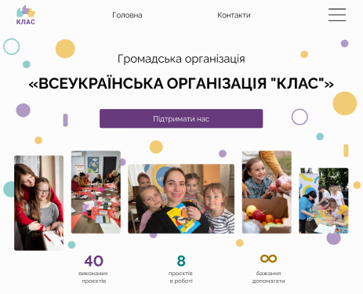

### Волонтерський проєкт зі створення сайту ГО «Всеукраїнська організація "Клас"»

### Команда розробників 🚀

    

1. Склонувати репозиторій в папку themes
2. Перейти в тему і встановити залежності npm install
3. Створити та перейти на нову гілку git (назвою гілки може бути назва сторінки)

Створення нового шаблона сторінки

1. В папці templates створюємо новий файл шаблону сторінки
2. src/styles/template-styles створюємо новий файл для стилів цієї сторінки
3. src/scripts/template-scripts створюємо новий файл для скриптів цієї сторінки
4. Підключаємо ці 2 файли в functions.php з умовою відображення тільки для цього шаблона
5. Запускаємо Gulp командою Gulp
6. Створюємо в адмінці нову сторінку і обираємо для неї створений шаблон

Всі глобальні стилі знаходяться у файлах папки src/styles і підключаються в файлі main.scss. Так само і скрипти (src/scripts). Редагувати файли глобальних стилів і скриптів можна лише з узгодженням з іншими членами команди проекту!!!

Після завершення розробки робиться push гілки на git та pull request в гілку main
